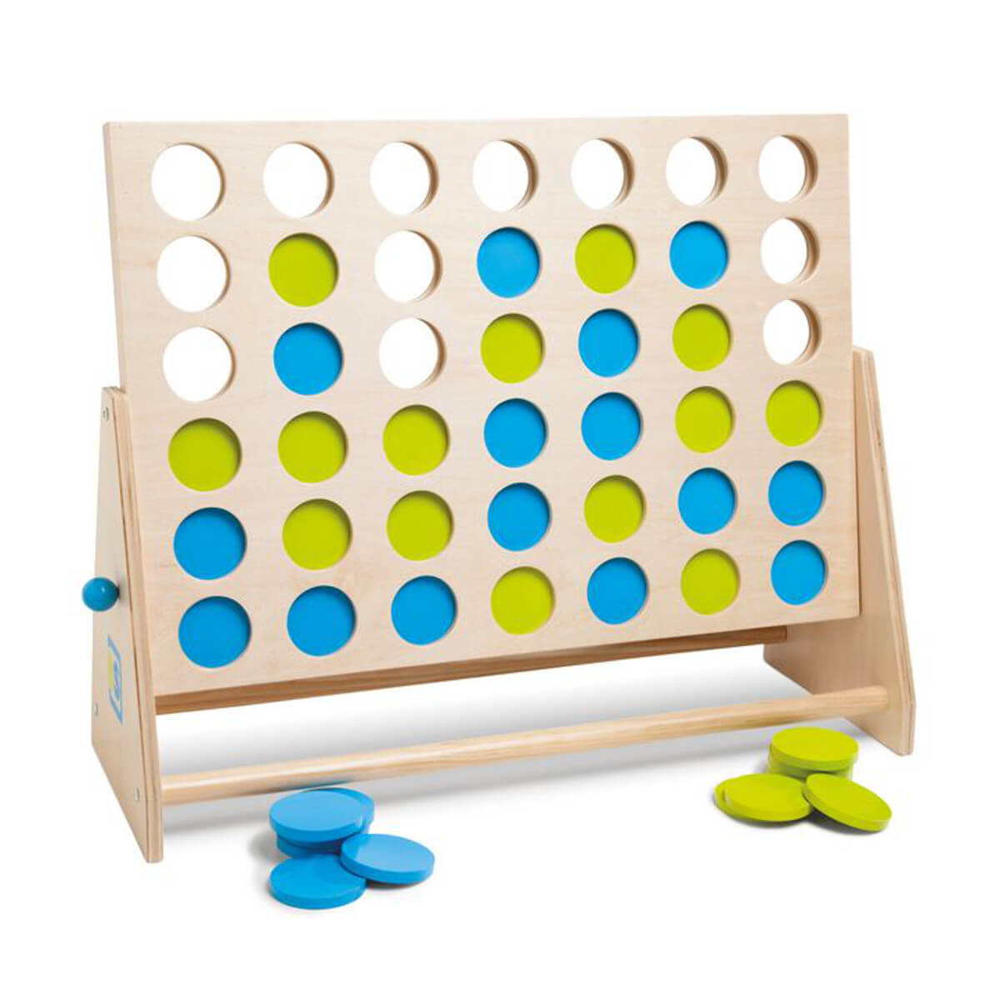
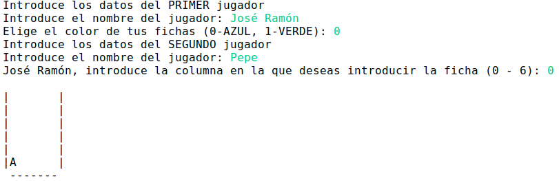
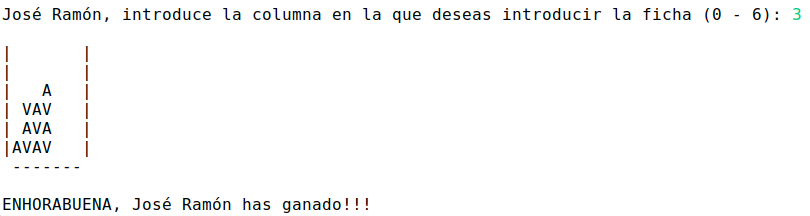
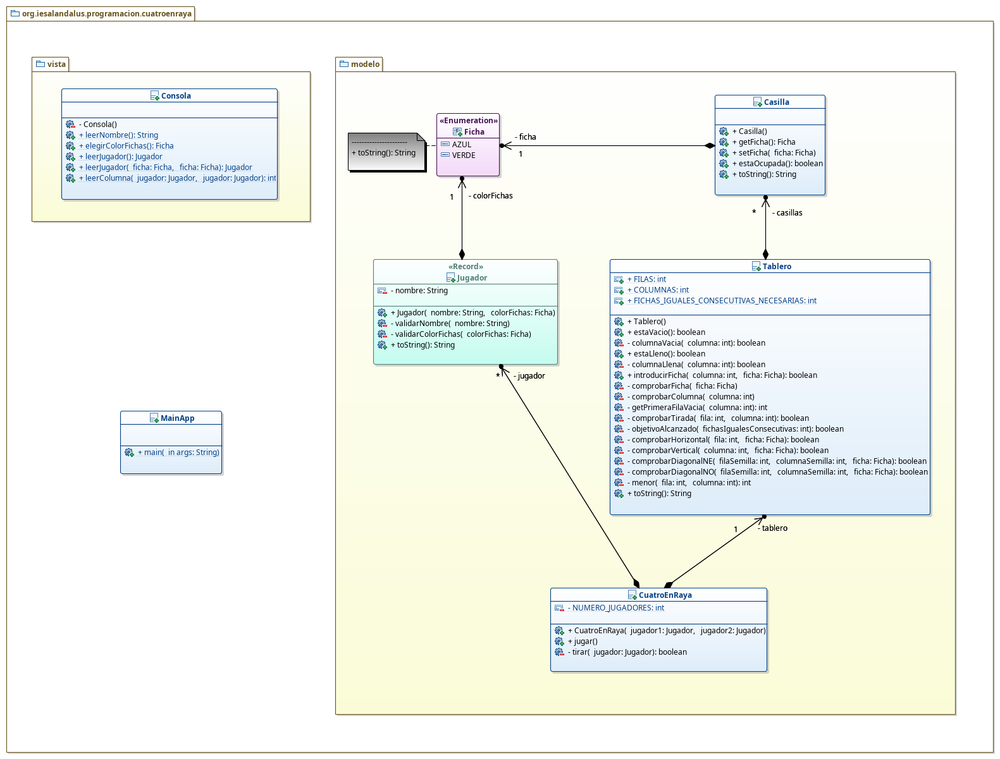

# Tarea: Cuatro en raya
## Profesor: José Ramón Jiménez Reyes
## Alumno:

Se trata de realizar un programa en java que simule el juego de las cuatro en raya.

En dicho juego, juegan dos jugadores. El primer jugador elige el color de las fichas y empieza el juego. En cada turno el jugador elegirá una columna que no esté llena en la que depositar su ficha. La ficha caerá por el tablero vertical hasta posarse en el fondo o encima de la última ficha que haya. Gana el juego el jugador que consiga alinear cuatro fichas, de su color bien sea en horizontal, vertical o diagonal. El programa detectará la jugada ganadora e informará del nombre del ganador.

En las siguientes imágenes muestro una salida de la ejecución del programa que debes realizar:

En este repositorio he creado un esqueleto de proyecto gradle que ya lleva incluidos todos los test necesarios que el programa debe pasar.

Para ello te muestro un diagrama de clases para el mismo y poco a poco te iré explicando los diferentes pasos a realizar:

#### Primeros Pasos

1. Lo primero que debes hacer es un fork de este repositorio.
2. Clona tu repositorio remoto recién copiado en **GitHub** a un repositorio local que será donde irás realizando lo que a continuación se te pide. Modifica el archivo `README.md` para que incluya tu nombre en el apartado "Alumno".
3. Realiza tu primer commit.

#### Creación del enumerado `Ficha`
1. Debes implementar el enumerado `Ficha` con los valores `VERDE` y `AZUL`.

#### Creación de la clase `Casilla`:
1. La clase `Casilla` tendrá un atributo del tipo `Ficha`.
2. Crea los métodos `get` y `set`, con la visibilidad indicada, que deberán hacer las comprobaciones necesarias o lanzar la excepción adecuada.
3. Crea el `constructor por defecto` que inicialmente pondrá el atributo ficha a `null`.
4. Crea el método `estaOcupada` que devolverá `true` o `false`, dependiendo de si la casilla contiene una ficha o no.
5. Crea el método `toString` que mostrará la inicial del valor de la ficha o un espacio en blanco si esta no está ocupada. Este método debe utilizar el método format de la clase `String` para generar la salida del mismo.

#### Creación del registro `Jugador`:
1. El registro `Jugador` tendrá dos atributos: uno del tipo `String` para el nombre del jugador y otro del tipo `Ficha` para almacenar el color de las fichas del jugador.
2. Crea los métodos `validarNombre` y `validarColorFichas`, con la visibilidad indicada, que deberán hacer las comprobaciones necesarias o lanzar la excepción adecuada.
3. Sobreescribe `constructor canónico` para que haga uso de los métodos `validarX` para validar el valor a los atributos.
4. Crea el método `toString` que imprimirá el nombre y el color de las fichas del jugador. Este método debe utilizar el método `format` de la clase `String` para generar la salida del mismo.

#### Creación de la clase `Tablero`:
1. La clase `Tablero` tendrá tres constantes para indicar el número de filas (6), el número de columnas (7) y el número de fichas consecutivas en línea para ganar. También tendrá como atributo un array bidimensional de objetos del tipo `Casilla`.
2. Crea el `constructor por defecto` que inicializará correctamente el array bidimensional de casillas.
3. Crea el método `columnaVacia` que devolverá `true` o `false` dependiendo que la columna pasada por parámetro esté vacía o no.
4. Crea el método `estaVacio` que devolverá `true` o `false` dependiendo de que el tablero esté vacío o no. Este método hará uso del método anteriormente creado.
5. Crea el método `columnaLlena` que devolverá `true` o `false` dependiendo que la columna pasada por parámetro esté llena o no.
6. Crea el método `estaLleno` que devolverá `true` o `false` dependiendo de que el tablero esté lleno o no. Este método hará uso del método anteriormente creado.
7. Crea el método `comprobaFicha` que lanzará una excepción si el parámetro pasado no es correcto.
8. Crea el método `comprobarColumna` que lanzará una excepción si el parámetro pasado no es correcto.
9. Crea el método `getPrimeraFilaVacia` que devolverá la primera fila vacía para la columna pasada por parámetro.
10. Crea el método `objetivoAlcanzado` que aceptará como parámetro el número de fichas consecutivas que llevamos en una de las comprobaciones (horizontal, vertical, diagonalNE o diagonalNO) y devolverá true o false si el parámetro pasado es mayor o igual que la constante definida en la clase para las fichas conscutivas necesarias.
11. Crea el método `comprobarHorizontal` que aceptará la fila y la ficha para la que queremos comprobar si hay cuatro fichas del mismo color seguidas en horizontal.
12. Crea el método `comprobarVertical` que aceptará la columna y la ficha para la que queremos comprobar si hay cuatro fichas del mismo color seguidas en vertical.
13. Crea el método `menor` que recibirá dos enteros y devolverá el menor de ellos.
14. Crea el método `comprobarDiagonalNE` que recibirá como parámetros la fila, la columna y la ficha para la que queremos comprobar si hay cuatro fichas del mismo color seguidas en la diagonal que va desde abajo a la izquierda hasta arriba a la derecha pasando por la casilla indicada por la fila y la columna. Para ayudarte, te indico que debes calcular el desplazamiento como el mínimo entre la fila y la columna pasadas. Luego calcularás la fila inicial como la fila pasada menos el desplazamiento y la columna inicial como la columna pasada menos el desplazamiento. Luego realizarás un bucle que empiece en la fila inicial y la columna inicial y termine cuando lleguemos al límite de las filas o de las columnas, e irá incrementando en uno la fila y la columna (las variables de control del bucle) y cuente cuántas fichas de ese color hay seguidas. Devolverá `true` si las fichas seguidas contadas es igual a 4.
15. Crea el método `comprobarDiagonalNO` que recibirá como parámetros la fila, la columna y la ficha para la que queremos comprobar si hay cuatro fichas del mismo color seguidas en la diagonal que va desde abajo a la derecha hasta arriba a la izquierda pasando por la casilla indicada por la fila y la columna. Para ayudarte, te indico que debes calcular el desplazamiento como el mínimo entre la fila y, el número total de columnas menos 1 menos la columna pasada. Luego calcularás la fila inicial como la fila pasada menos el desplazamiento y la columna inicial como la columna pasada más el desplazamiento. Luego realizarás un bucle que empiece en la fila inicial y la columna inicial y termine cuando lleguemos al límite de las filas o 0 para las columnas, e irá incrementando en uno la fila y decrementando en uno la columna (las variables de control del bucle) y cuente cuántas fichas de ese color hay seguidas. Devolverá `true` si las fichas seguidas contadas es igual a 4.
16. Crea el método `comprobarTirada` que aceptará como parámetros la fila, la columna y la ficha de la última tirada para comprobar si es ganadora o no. Este método hará uso de los métodos `comprobarXXX` anteriormente definidos.
17. Crea el método `introducirFicha` que aceptará como parámetros la columna en la que queremos introducir la ficha y la ficha a introducir y devolverá true o false dependiendo de si la jugada ha sido ganadora o no (hemos conseguido cuatro en raya o no). Este método deberá comprobar la validez de los parámetros pasados o lanzar la excepción correspondiente. También podrá lanzar una excepción indicando que la columna en la que queremos introducir la ficha está llena. Para ello este método hará uso de los métodos anteriormente creados.
18. Crea el método `toString` que haciendo uso de la clase `StringBuilder` devuelva la representación del tablero que has visto en las imágenes anteriores.

#### Creación de la clase `Consola`:
1. Crea el `contsructor` adecuado para evitar que se puedan crear instancias de esta clase, ya que, será una clase de utilidades.
2. Crea el método `leerNombre` que leerá el nombre del jugador mientras este sea válido.
3. Crea el método `elegirColorFichas` que leerá el color de una ficha mientras este no sea válido.
4. Crea el método `leerJugador` que, sin aceptar parámetros, leerá el nombre del primer jugador y el color de sus fichas y lo devolverá.
5. Crea el método `leerJugador` que, aceptando como parámetro una ficha, leerá el nombre del segundo jugador y devolverá dicho jugador con el color de ficha pasado por parámetro.
6. Crea el método `leerColumna` que recibirá como parámetro el jugador que debe introducir la columna para una tirada y devolverá un entero representando la columna elegida. El método imprimirá el nombre del jugador y le indicará que elija la columna en la que quiere introducir su ficha y esto lo repetirá mientras la columna elegida no sea válida.

#### Creación de la clase `CuatroEnRaya`:
1. La clase `CuatroEnRaya` tendrá una constante para indicar el número de jugadores (2), un atributo que será un array de objetos del tipo `Jugador` y otro atributo de la clase `Tablero`.
2. Crea el `constructor con parámetros` al que le pasaremos como parámetros dos instancias del tipo Jugador representando a cada uno de los jugadores. Deberá hacer las comprobaciones adecuadas o lanzar la excepción adecuada. También deberá crear correctamente el array de jugadores e incializarlo y crear la instancia de la clase Tablero.
3. Crea el método `tirar` que recibirá como parámetro el jugador que va a tirar y devolverá true o false indicando si esa jugada ha resultado ganadora o no. Para ello leerá la columna en la que el jugador quiere introducir la ficha llamando al método correcto de la clase Consola y llamará al método introducirFicha de la clase Tablero que devolverá si la jugada ha sido ganadora o no, o lanzará una excepción indicando que la fila está llena, la cual debemos capturar para informar al jugador y volver a repetir el proceso mientras no se introduzca una fila que no esté llena o la jugada haya resultado ganadora.
4. Crea el método `jugar` que repetirá, mientras queden casillas libres y no haya ganador, la acción de tirar alternando los jugadores en cada iteración. Al terminar informará de quién ha ganado o que no hay más casillas libres.

#### Creación de la `MainApp`:
1. Crea el método `main` que creará los jugadores, creará una instancia de CuatroEnRaya con ambos jugadores y los pondrá a jugar. 

#### Se valorará:

- La indentación debe ser correcta en cada uno de los apartados.
- Los identificadores utilizados deben ser adecuados y descriptivos.
- Se debe utilizar la clase `Entrada` para realizar la entrada por teclado que se encuentra como dependencia de nuestro proyecto en la librería `entrada`.
- El programa debe pasar todas las pruebas que van en el esqueleto del proyecto y toda entrada del programa será validada, para evitar que el programa termine abruptamente debido a una excepción.
- La corrección ortográfica tanto en los comentarios como en los mensajes que se muestren al usuario.